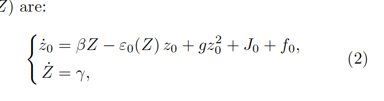

# Week 0 — Content ideas

Twitter/X posts, reels, and shorts drawn from the week's talks and papers.

---

## Fedichev — biophysics of aging

#### gompertz law
- current biological clocks don't explain the rapid doubling in mortality every 8 years
- 'A Minimal Model Explains Aging Regimes and Guides Intervention Strategies'
- something else does - DOSI?
- In many animal species, mortality rates increase approximately exponentially with age over substantial adult ranges,    consistent with the Gompertz law [4, 5].
The slope of this rise defines the mortality acceleration
and corresponds to a characteristic mortality-rate doubling
time.
- This pattern stands in contrast to most engineered systems,
where reliability theory typically predicts hazards
that grow as power laws with age, rather than exponentially
[29–31]. Exponential hazard growth is the exception
rather than the rule in technical systems, but
in biology it is nearly ubiquitous.
- The widespread appearance
of Gompertzian mortality therefore suggests
a form of universality: a characteristic large-scale behaviour
that emerges in organisms shaped by evolutionary
pressures, extrinsic mortality, and internal constraints,
despite diversity in life histories, metabolism,
regeneration, genome architecture, and lifespan
- Deviations
from the pattern are especially informative.
A small number of species, such as the naked molerat
- In many other taxa, hazards accelerate exponentially
at earlier ages but slow at advanced ages, approaching
a late-life plateau
- biology behind gompertz.....

#### traditional aging clock vs PCA approach
- one PC is linear with age, one is exponential - this is rule?
- this corresponds to the pathways vs entropy thing, and usual clocks dont consider this

#### this equation describes all of aging...

- start vid off with iamge then talk about each part of it